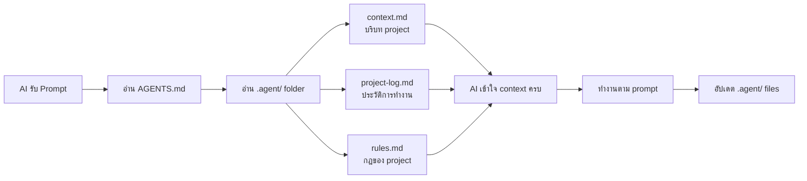

# 🛠️ base-setup-project

> **ระบบ Agent Context สำเร็จรูป** — Template สำหรับทุก project ที่ต้องการให้ AI เข้าใจบริบทตลอดเวลา

---

## 📋 สรุปโปรเจกต์ (Project Summary)

Project นี้คือ **โครงสร้างพื้นฐาน (Base Setup)** ที่ออกแบบมาเพื่อแก้ปัญหาสำคัญ:

> ❓ **ปัญหา:** ทุกครั้งที่เริ่มสนทนาใหม่กับ AI, AI จะ "ลืม" ทุกอย่างเกี่ยวกับ project — ต้องอธิบายซ้ำทุกครั้ง

> ✅ **วิธีแก้:** สร้างระบบ **Agent Context System** ที่บังคับ AI อ่าน context ของ project ก่อนเริ่มทำงานทุกครั้ง โดยอัตโนมัติ

---

## 🧠 กลไกการทำงาน (How It Works)



**ขั้นตอน:**

1. AI ได้รับ prompt จาก user
2. AI อ่าน `AGENTS.md` → รู้ว่าต้องอ่าน `.agent/` ก่อน
3. AI อ่าน 3 files หลัก → เข้าใจ context, ประวัติ, กฎ ครบถ้วน
4. AI ทำงานตาม prompt ได้อย่างถูกต้อง
5. AI อัปเดต files ใน `.agent/` หลังทำงานเสร็จ

---

## 📁 โครงสร้างไฟล์ (File Structure)

```
project-root/
├── AGENTS.md                          # คำสั่งบังคับ AI (จุดเริ่มต้น)
└── .agent/                            # 🧠 ระบบ Agent Context
    ├── context.md                     # บริบทของ project
    ├── project-log.md                 # ประวัติการทำงานทั้งหมด
    ├── rules.md                       # กฎที่ต้องปฏิบัติตาม
    └── workflows/
        └── read-context.md            # Workflow อ่าน 3 files อัตโนมัติ
```

### รายละเอียดแต่ละไฟล์

| ไฟล์              | หน้าที่                                                    | รูปแบบการเขียน                     |
| ----------------- | ---------------------------------------------------------- | ---------------------------------- |
| `AGENTS.md`       | คำสั่งระดับ root บังคับ AI อ่าน `.agent/`                  | ภาษาไทย — กระชับ ชัดเจน            |
| `context.md`      | บริบท project: จุดประสงค์, tech stack, โครงสร้าง, ข้อจำกัด | ภาษาไทย — เขียนแบบวิศวกร           |
| `project-log.md`  | Timeline, สถานะ, งานค้าง, ปัญหา, การตัดสินใจ               | ภาษาไทย — เขียนแบบ Project Manager |
| `rules.md`        | Coding standards, naming, Git workflow, security           | ไทย + English (ศัพท์ programming)  |
| `read-context.md` | Workflow สั่ง AI อ่าน 3 files ก่อนทำงาน                    | ภาษาไทย — step-by-step             |

---

## 🚀 วิธีใช้งาน (How to Use)

### สำหรับ Project ใหม่

1. **Clone** repo นี้ลง local
   ```bash
   git clone https://github.com/<your-username>/base-setup-project.git <ชื่อ-project-ใหม่>
   ```
2. **เปิด** `context.md` → กรอกข้อมูล project ของคุณ
3. **แก้ไข** `rules.md` → ปรับกฎให้เหมาะกับ project
4. **เริ่มทำงาน** — AI จะอ่าน context อัตโนมัติทุกครั้ง

### สำหรับ Project ที่มีอยู่แล้ว

1. **Copy** folder `.agent/` และ `AGENTS.md` ไปที่ root ของ project
2. กรอกข้อมูลในแต่ละไฟล์
3. เริ่มทำงานได้ทันที

---

## ⚠️ ข้อควรระวัง (Important Notes)

- ❌ **ห้ามลบ** folder `.agent/` หรือไฟล์ข้างใน — เป็น "สมอง" ของ project
- ❌ **ห้ามลบ** `AGENTS.md` — เป็นจุดเริ่มต้นที่ AI อ่านก่อน
- ✅ **ต้องอัปเดต** `project-log.md` ทุกครั้งหลังทำงานเสร็จ
- ✅ **ต้องอัปเดต** `context.md` เมื่อมีการเปลี่ยนแปลง tech stack หรือ scope

---

## 🔧 เทคโนโลยี (Technologies)

| เทคโนโลยี        | ใช้ทำอะไร                   |
| ---------------- | --------------------------- |
| Markdown (.md)   | เขียน documentation ทั้งหมด |
| Git              | Version control             |
| GitHub           | Host repository             |
| YAML Frontmatter | Workflow metadata           |

---

## 👤 ผู้พัฒนา (Developer)

- **ชื่อ:** qqkiller2006
- **สร้างเมื่อ:** 1 มีนาคม 2569

---

## 📄 License

MIT License — ใช้ได้อิสระ แก้ไขได้ตามต้องการ
